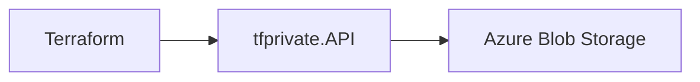

Terraform Private Registry API
A self-hosted, open source Terraform registry API that implements the Terraform Registry Protocol for hosting and managing private modules. Inspired by the lack of a straightforward solution to self-host a private registry, this project aims to provide a simple, configurable alternative that runs on your own infrastructure.



Table of Contents

- [Features](#features)
- [Getting Started](#getting-started)
  - [Azure Storage Setup](#azure-storage-setup)
  - [Application Configuration](#application-configuration)
  - [Run the Application](#run-the-application)
  - [Upload and Use a Module](#upload-and-use-a-module)
- [API Endpoints](#api-endpoints)
- [Authentication](#authentication)
- [Application Insights](#application-insights)
- [Docker Setup](#docker-setup)
- [Configuration](#configuration)
- [Using with Terraform](#using-with-terraform)
- [Module Structure Requirements](#module-structure-requirements)

Features

- Host private Terraform modules behind a simple API
- Azure Blob Storage backend for module binaries
- Version management for modules
- Secure API key authentication
- Optional Application Insights support
- Docker support

Getting Started

Azure Storage Setup

1. Create an Azure Storage Account in your Azure subscription.
2. Locate the storage account name and primary access key under the "Access keys" section.
3. These values will be used for STORAGE_ACCOUNTNAME and STORAGE_ACCESS_KEY in your application configuration.

Application Configuration
Create a .env file in the root of your project (and add it to .gitignore). For example:

```
STORAGE_ACCOUNTNAME=your_account_name
STORAGE_ACCESS_KEY=your_access_key
API_KEY=your_api_key
APP_INSIGHT_KEY=your_app_insights_key  # optional
```

Run the Application
You can run this API in multiple ways:

• Docker (Recommended)  
 Build the image:

```
docker build -t tfprivate-api .
```

Run with your .env:

```
docker run --env-file .env -p 80:80 -p 443:443 tfprivate-api
```

• Using .NET directly

```
cd tfprivate.Api
dotnet run
```

The API will be served on http://localhost:80 or https://localhost:443 (depending on your configuration). A Swagger UI is also available at https://localhost:443/swagger in development.

Upload and Use a Module

1. Create a compressed tar archive of your module:
   ```
   tar -czf my-module.tgz my-module/
   ```
2. Upload it to the registry:
   ```
   curl -X POST \
     -H "X-API-Key: your_api_key" \
     -F "file=@my-module.tgz" \
     https://your-registry-url/v1/module/myorg/my-module/1.0.0
   ```
3. Reference the module in your Terraform configuration:
   ```
   module "example" {
     source  = "https://your-registry-url/v1/module/myorg/my-module/1.0.0"
   }
   ```
4. Configure authentication in ~/.terraformrc:
   ```
   credentials "your-registry-url" {
     token = "your_api_key"
   }
   ```

API Endpoints

- GET /v1/modules/{namespace}  
  Lists all modules in a given namespace.  
  Example: /v1/modules/acme

- GET /v1/module/{namespace}/{module_name}  
  Returns the latest version’s download URL for the specified module.  
  Example: /v1/module/acme/my_module

- GET /v1/module/{namespace}/{module_name}/{version}  
  Returns the download URL for a specific version of a module.  
  Example: /v1/module/acme/my_module/1.0.0

- POST /v1/module/{namespace}/{module_name}/{version}  
  Uploads a new module version (requires API key).  
  Example:

  ```
  curl -X POST \
    -H "X-API-Key: your_api_key" \
    -F "file=@module.tgz" \
    https://your-registry-url/v1/module/acme/my_module/1.0.0
  ```

- GET /v1/modules/{namespace}/{module_name}/versions  
  Lists all available versions of a module.  
  Example: /v1/modules/acme/my_module/versions

Authentication
All write operations require an API key via the X-API-Key header. You can generate one with a command like:

```
openssl rand -base64 32
```

Application Insights
Optionally, you can enable Azure Application Insights by providing its connection string.  
• Use the environment variable APP_INSIGHT_KEY  
• Or configure Azure:AzureMonitor:ConnectionString in appsettings.json

If neither is provided, telemetry will be disabled.

Docker Setup

1. Build the Docker image:
   ```
   docker build -t tfprivate-api .
   ```
2. Run the container (example using environment variables):
   ```
   docker run -p 80:80 -p 443:443 \
     -e STORAGE_ACCOUNTNAME=your_account_name \
     -e STORAGE_ACCESS_KEY=your_access_key \
     -e API_KEY=your_api_key \
     -e APP_INSIGHT_KEY=your_app_insights_key \
     tfprivate-api
   ```
3. Or use an .env file:
   ```
   docker run --env-file .env -p 80:80 -p 443:443 tfprivate-api
   ```
4. Use docker-compose:
   ```yaml
   version: "3"
   services:
     api:
       build: .
       ports:
         - "80:80"
         - "443:443"
       env_file:
         - .env
   ```
5. The repository also includes an example docker-compose.yml and a Caddyfile for production setups. Caddy handles HTTPS certificates automatically. Update the domain in the Caddyfile to match yours and run:
   ```
   docker compose up -d
   ```

Configuration
Environment Variables

- STORAGE_ACCOUNTNAME: Azure Storage account name
- STORAGE_ACCESS_KEY: Azure Storage access key
- API_KEY: API key for authentication
- APP_INSIGHT_KEY: Application Insights connection string (optional)
- ASPNETCORE_ENVIRONMENT: Runtime environment (defaults to "Production")

Using with Terraform
Once the API is running at https://your-registry-url, you can reference modules in your Terraform configurations by specifying the registry URL:

```
module "example" {
  source = "https://your-registry-url/v1/module/acme/my_module/1.0.0"
}
```

Then add the credentials to ~/.terraformrc:

```
credentials "your-registry-url" {
  token = "your_api_key"
}
```

Module Structure Requirements
Terraform requires certain files within your archived module:

1. Files in the root of the archive, for example:

   ```
   module.tgz
   ├── main.tf
   ├── providers.tf
   ├── variables.tf (or variable.tf)
   ├── outputs.tf   (or output.tf)
   └── README.md    (optional)
   ```

2. Alternatively, a single subdirectory inside the archive:
   ```
   module.tgz
   └── my-module/
       ├── main.tf
       ├── providers.tf
       ├── variables.tf
       ├── outputs.tf
       └── README.md
   ```

At minimum, main.tf, providers.tf, and either variables.tf (or variable.tf) and outputs.tf (or output.tf) must be present for a valid module.

Happy terraforming! If you encounter any issues or want to contribute, feel free to open an issue or submit a pull request.
